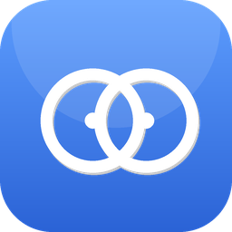
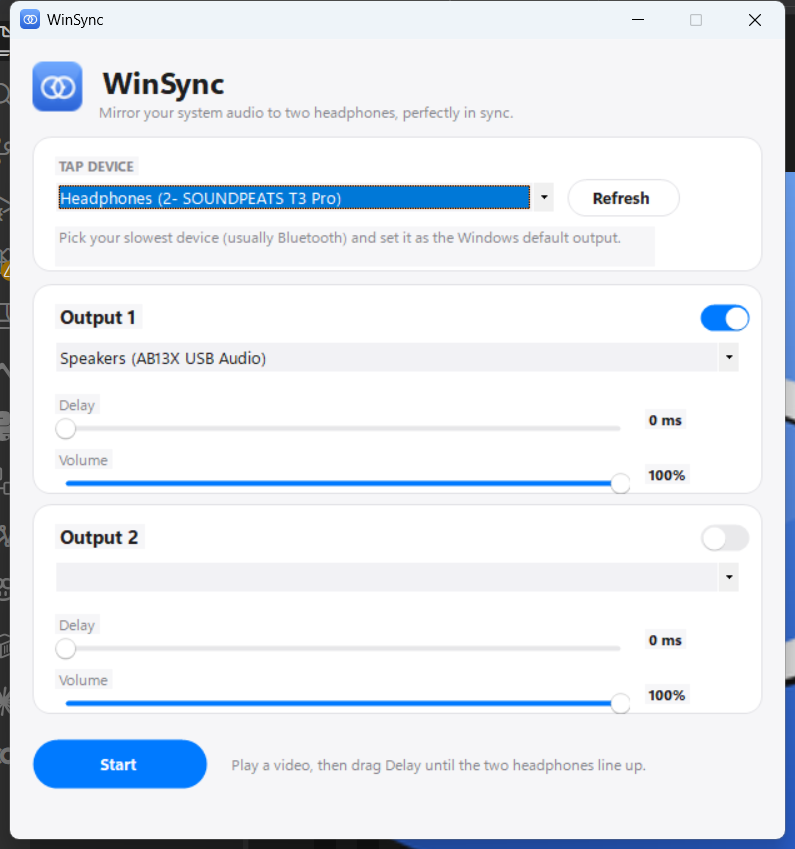

<div align="center">



# WinSync

**Play the same system audio through two headphones on Windows — perfectly in sync.**

Any mix of wired, Bluetooth and USB. No driver. No admin rights.

[](https://dotnet.microsoft.com/)
[](#)
[](LICENSE)

**[winsync.ashfaknawshad.dev](https://winsync.ashfaknawshad.dev)**



</div>

---

Windows routes system audio to a single output device at a time. There's no
built-in way for two people to share one laptop through two separate pairs of
headphones — short of a splitter cable, a virtual mixer you configure by hand,
or Windows 11's Shared Audio, which only works if **both** headphones support
Bluetooth LE Audio.

WinSync solves the common case instead: **one wired headphone + one Bluetooth
headphone** (or any two devices), synchronized to within perceptual tolerance,
with drift correction so it stays that way for a two-hour movie.

## How it works

WinSync taps one real audio endpoint with WASAPI loopback capture and
re-renders that stream to one or more other endpoints, each with its own
adjustable delay and volume.

```
Tap endpoint ──(WASAPI loopback capture)──▶ ring buffer
                                              ├─▶ delay / gain ─▶ WASAPI render → Output 1
                                              └─▶ delay / gain ─▶ WASAPI render → Output 2
```

The key trick: **loopback capture happens inside the Windows audio engine,
before the signal reaches the Bluetooth radio.** So the captured copy is not
delayed by Bluetooth — only what the Bluetooth headphone actually plays is
late. That means you tap the *slowest* device and add delay to the *faster*
one to catch up. Tap the wired device instead and you'd need negative delay on
Bluetooth, which is impossible.

**Rule of thumb: always tap whichever device has the highest latency.**

A background loop also corrects for clock drift — two devices never share a
crystal oscillator, so their sample clocks slowly diverge. WinSync nudges
playback speed by at most ±0.3% every 250ms to hold the buffer at its target
fill level. That's well under the threshold where pitch change is audible, and
because it's a continuous nudge rather than dropping or duplicating samples,
there are no clicks.

For the full design writeup — endpoint architecture, the options considered
and rejected (kernel driver, hardware transmitter), and the drift-correction
math — see [`Dual-Audio-Report.md`](Dual-Audio-Report.md).

## Install

Grab the latest release from [Releases](../../releases). Two options:

- **`WinSync-Setup.msi`** (recommended, ~700KB) — a proper per-user installer:
  Start Menu shortcut, clean uninstall via Settings → Apps, no admin rights
  needed. Requires the [.NET 8 Desktop Runtime](https://dotnet.microsoft.com/download/dotnet/8.0)
  — if it's missing, WinSync's own launcher will prompt you to install it the
  first time you run it.
- **`WinSync.exe`** (~70MB) — a single portable, self-contained file with the
  .NET runtime bundled in. No install, no prerequisites, just run it.

> Windows SmartScreen may warn about an unsigned file on first run. Click
> **More info → Run anyway**. WinSync is free and open source; you can read
> every line of it right here. (Working on getting this signed — see
> [SIGNING.md](SIGNING.md).)

### Build from source

```
git clone https://github.com/ashfaknawshad/winsync.git
cd winsync
dotnet publish -c Release -p:PublishProfile=Portable-win-x64    # standalone exe
dotnet publish -c Release -p:PublishProfile=Installer-win-x64   # small, for the MSI
```

Outputs land in `bin\publish\portable-win-x64\` and `bin\publish\installer-win-x64\`.

Or just `dotnet run` to launch it directly during development (requires the
[.NET 8 SDK](https://dotnet.microsoft.com/download/dotnet/8.0)).

### Build the MSI

```
dotnet tool restore
dotnet publish -c Release -p:PublishProfile=Installer-win-x64
dotnet build Installer -c Release
```

The MSI lands in `Installer\bin\x64\Release\WinSync-Setup.msi` (built with the
[WiX Toolset](https://wixtoolset.org/) v5).

## Usage

**Wired + Bluetooth (the common case):**

1. Connect both headphones.
2. Set the **Bluetooth** headphone as the Windows default output (Win+Ctrl+V,
   or Settings → System → Sound). VLC and Chrome will follow it.
3. In WinSync, set **Tap device** to that same Bluetooth headphone.
4. Set **Output 1** to the wired headphone.
5. Press **Start**, play a video, and drag the Output 1 **Delay** slider until
   the two headphones line up. Typical landing spot is 120–250ms.

The delay depends on the Bluetooth codec in use, so it varies per headset —
but it's stable for a given one. Worth writing down once you find it.

**Two wired headphones, or perfect symmetry:** the tap device plays with no
added delay while mirrored outputs sit ~90ms behind, so two wired headphones
alone will drift out of step with each other. Fix: tap a device nobody
listens to — [VB-Cable](https://vb-audio.com/Cable/)'s CABLE Input, an unused
HDMI/SPDIF endpoint, or a spare USB audio dongle — so both real headphones are
mirrored outputs with independent sliders.

## Known limitations

| Limitation | Cause | Workaround |
|---|---|---|
| Netflix / some Edge playback is silent | Protected media path blocks loopback capture | Use Chrome |
| VLC in exclusive mode isn't captured | Loopback requires shared mode | VLC → Preferences → Audio → Output module: Automatic or WASAPI |
| Two wired headphones ~90ms out of step | Tap plays undelayed; mirrors carry the jitter cushion | Tap a silent device (VB-Cable, unused HDMI/SPDIF, dummy USB dongle) |
| Bluetooth quality drops when a mic is used | Windows switches A2DP → HFP | Disable the "Hands-Free" endpoint in Sound settings |
| Two Bluetooth headsets stutter | Two A2DP streams contending for one radio | Add a second USB Bluetooth adapter |
| Adds ~90ms latency to mirrored outputs | Jitter headroom in the ring buffer | Fine for video; not for gaming/production |

## Roadmap

- [ ] Saved presets, keyed on device ID
- [ ] Global hotkeys to nudge delay without alt-tabbing
- [ ] Tray/minimized operation
- [ ] Automatic latency estimation (correlated marker instead of manual tuning)
- [ ] Third+ output (the engine already supports N; only the UI is fixed at two)

## Contributing

Issues and PRs welcome. The codebase is small on purpose:

- [`AudioMirror.cs`](AudioMirror.cs) — the audio engine (capture, resample/drift, mirror targets)
- [`MainForm.cs`](MainForm.cs) / [`Controls.cs`](Controls.cs) — the UI
- [`Program.cs`](Program.cs) — entry point

## License

[MIT](LICENSE)
